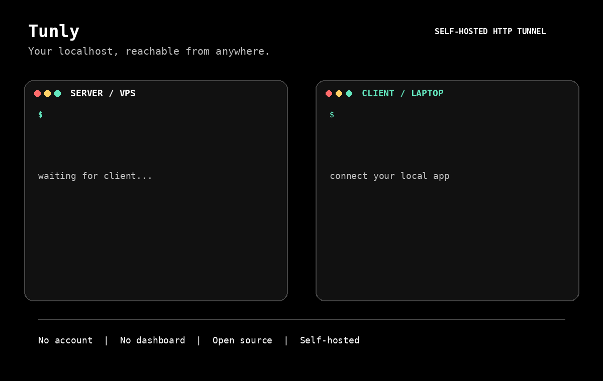

# Tunly

[](https://www.rust-lang.org/)
[](https://opensource.org/licenses/MIT)
[](https://github.com/0xReLogic/Tunly/releases)
[](https://github.com/0xReLogic/Tunly/releases)

[](https://github.com/0xReLogic/Tunly/actions/workflows/codeql.yml)
[](https://github.com/0xReLogic/Tunly/actions/workflows/rust-ci.yml)
[](https://github.com/0xReLogic/Tunly/actions/workflows/frontend-ci.yml)
[](https://github.com/0xReLogic/Tunly/actions/workflows/release.yml)

**Tunly** is a self-hosted HTTP tunnel for sharing a local app from anywhere.

No account. No dashboard. No vendor lock-in. Run one small server, connect your
local machine, and share the public URL.

[Download Tunly](https://github.com/0xReLogic/Tunly/releases) · [Quick Start](#self-hosted-setup) · [Report a bug](https://github.com/0xReLogic/Tunly/issues/new)

## Install

Build and install the CLI from crates.io:

```bash
cargo install tunly --locked
```

Or download a prebuilt archive from [Releases](https://github.com/0xReLogic/Tunly/releases).
Every archive includes `tunly`, `tunly-server`, and `tunly-client`.



```bash
# On your VPS
tunly-server --bind 0.0.0.0:8080

# On your laptop
tunly-client --remote-host your-server.com:8080 --local 127.0.0.1:3000
```

Your localhost is now reachable through a shareable Tunly URL.

### macOS

Apple Silicon and Intel Macs can use the same universal download:

```bash
brew install https://github.com/0xReLogic/Tunly/releases/latest/download/tunly.rb
```

Or install manually:

```bash
curl -LO https://github.com/0xReLogic/Tunly/releases/latest/download/tunly-macos-universal.tar.gz
tar xzf tunly-macos-universal.tar.gz
sudo install -m 755 tunly tunly-client tunly-server /usr/local/bin/
```

The universal binary runs natively on both Apple Silicon and Intel Macs.

Check the installation and optionally keep the client connected in the background:

```bash
tunly doctor
tunly install --remote-host tunly.allenarch.dev:8080 --local 127.0.0.1:3000 \
  --token-url https://tunly.allenarch.dev/token
```

Remove the background service with `tunly uninstall`.

### Automatic HTTPS with ACME

Point your domain DNS at the Tunly server, expose port `443`, and let Tunly
obtain and renew a Let's Encrypt certificate automatically:

```bash
tunly-server --bind 0.0.0.0:443 \
  --acme-domain tunly.allenarch.dev \
  --acme-email you@example.com \
  --acme-cache /var/lib/tunly/acme
```

Tunly uses TLS-ALPN validation and persists the ACME account and certificate
cache so renewals do not require a server restart. Use `--acme-staging` while
testing to avoid Let's Encrypt production rate limits.

---

## Why Tunly?

- **Self-hosted**: run the server on your VPS and keep traffic under your control.
- **Simple**: connect a local app and share one URL without creating an account.
- **Secure by default**: ephemeral, single-use tokens are bound to the client IP and session.
- **Fast**: native Rust, WebSockets, HTTP/2, compression, and a small binary footprint.
- **Observable**: structured logs, Prometheus metrics, and per-session request history.
- **Cross-platform**: prebuilt binaries and `cargo install` for Linux, macOS, and Windows.

---

## Quick Start

### Self-hosted setup

1. **Download** `tunly-client` and `tunly-server` for your OS from [Releases](https://github.com/0xReLogic/Tunly/releases)
2. **Start the server** on your VPS or cloud:
  ```bash
  tunly-server --bind 0.0.0.0:8080
   ```
3. **Run the client** locally:
   ```bash
   tunly-client --remote-host your-server.com:8080
   ```
4. When prompted, get a token from `http://your-server.com:8080/token` and paste it
5. Enter your local address when prompted (default: `127.0.0.1:80`)
6. The client will print your **Public URL**, e.g., `https://your-server.com/s/<session>/` — share this URL
7. View the session log: `https://your-server.com/s/<session>/_log`

> Notes:
> - Long flags use kebab-case (e.g., `--remote-host`, `--token-url`, `--allow-token-query`).
> - Default auth uses header `Authorization: Bearer <token>`. Query `?token=...` works only if server enables `--allow-token-query`.
> - For self-host without TLS, pass `--use-wss=false` so the client uses `ws://` (the flag accepts an explicit boolean, e.g., `--use-wss=false`).

### Build from source

If building from source:

- **Self-host** — run your own server, then point client to it.

  1) Start server (ephemeral token mode):
  ```
  cargo run --bin tunly-server -- --bind 0.0.0.0:9000
  ```

  2a) Start client (interactive, custom server):
  ```
  cargo run --bin tunly-client -- --remote-host <server-ip-or-host>:9000 --use-wss=false --local 127.0.0.1:8080
  ```

  2b) Start client (auto-fetch token):
  ```
  cargo run --bin tunly-client -- --remote-host <server-ip-or-host>:9000 \
    --use-wss=false \
    --local 127.0.0.1:8080 \
    --token-url http://<server-ip-or-host>:9000/token
  ```

  3) Open the Public URL printed by the client, e.g.:
  ```
  http://<server-ip-or-host>:9000/s/<session>/
  ```

  4) Check recent paths accessed by visitors for that session:
  ```
  http://<server-ip-or-host>:9000/s/<session>/_log
  ```

#### Local offline test (no TLS)

For a quick local test without internet:

1) Start server with a fixed token:
```
cargo run --bin tunly-server -- --bind 127.0.0.1:9000 --token devtoken
```

2) Start client (interactive) and connect over ws:
```
cargo run --bin tunly-client -- --remote-host 127.0.0.1:9000 --use-wss=false
```
When prompted, enter `devtoken`, then your local app address (e.g., `127.0.0.1:8080`).

### Loginless / Ephemeral Token Mode (no dashboard, no signup)

If you don't want to manage a static token, run the server without `--token` and without env `TUNLY_TOKEN`. The server will issue one-time tokens bound to the requester's IP via `/token`.

- **Start server (ephemeral mode)**
  ```
  tunly-server.exe --port 9000
  ```
- **Client auto-fetch token (advanced)**
  ```
  tunly-client.exe --remote-host <vps-address>:9000 --token-url http://<vps-address>:9000/token
  ```
  The client fetches a token from `/token` (JSON or plain text) and connects via WebSocket using that token.

Notes:
- Tokens are one-time use, may be bound to the requester IP, and expire in ~5 minutes.
- Default auth is via header `Authorization: Bearer <token>`; `?token=` query is disabled unless `--allow-token-query` is set on the server.
- If you prefer a fixed token, set `--token <value>` or env `TUNLY_TOKEN` on the server and keep using `config.txt` or env on the client.

### Fixed vs Ephemeral Tokens

- **Fixed Token**
  - Server: run with `--token <value>` or env `TUNLY_TOKEN`.
  - Client: paste token when prompted, or set it via `config.txt`/`TUNLY_TOKEN`.
  - Best for interactive UX testing and simple setups.

- **Ephemeral Token**
  - Server: run without `--token` (issues one-time tokens via `/token`, tied to `session`+IP, TTL ~5 minutes).
  - Client: use `--token-url http://<server>:<port>/token` so the token matches the current `sid` automatically.
  - Manual prompt is not compatible with Ephemeral mode (will be rejected as invalid).

### Server Hosting Options
- **Cheap VPS**: DigitalOcean, Vultr, Linode ($5/month)
- **Free cloud**: Oracle Cloud Free Tier, Google Cloud Free Tier
- **Platform-as-a-Service**: Render, Railway, Koyeb (easy deployment)

---

## Environment & Deploy

You can configure Tunly using environment variables. See the `.env.example` files in the root, `backend/`, and `frontend/` directories for templates.

- **Server env**:
  - `PORT` (from platform, e.g., Render, Koyeb) — server listens on this port automatically.
  - `TUNLY_TOKEN` — optional; if set, server uses fixed-token mode. If not set and `--token` is not provided, server uses ephemeral mode with `/token` issuance.
  - `TUNLY_INTERNAL_KEY` — optional; if set, restricts `/token` access to requests providing this key in the `X-Internal-Key` header (prevents direct `curl` requests to your backend).
- **Client config**:
  - `config.txt` with `token: <value>` (tolerant to `token=`/`token:`/`tokenn`).
  - Or env `TUNLY_TOKEN`.
  - Or runtime fetch via `--token-url http://<server>:<port>/token` (ephemeral mode).
- **Frontend env**:
  - `BACKEND_BASE_URL` — base URL of your Tunly backend (e.g., `https://<your-app>.koyeb.app` or your custom domain). Used by the Next.js proxy route `app/api/token/route.ts` to call `/token`.
  - `TUNLY_INTERNAL_KEY` — must match the server's key to allow the frontend to fetch tokens securely via the Next.js API route.
- **Deploy on Koyeb**:
  - Source: Docker → Dockerfile path: `backend/Dockerfile`
  - Health check: `GET /healthz`
  - Environment:
    - `TUNLY_TOKEN` (optional): set for Fixed mode; leave empty for Ephemeral mode (`/token` enabled)
    - `PORT`: injected automatically by Koyeb (no need to set)
  - Optional: add a custom domain; Koyeb will provision TLS automatically

---

## Security & Limits

- `/token` rate limit: 10 requests per 60 seconds per IP
- Ephemeral token TTL: ~5 minutes; single use; bound to requester's IP and session id
- Proxy request body limit: 2 MB
- Session idle TTL: ~10 minutes (inactive sessions are garbage-collected)

---

## Logs & Observability

- **Server logs** each proxied request:
  ```
  PROXY GET / -> 200 in 16ms (sid=abc123)
  ```
- **Client logs** each local request it performs:
  ```
  LOCAL GET /api -> 200 in 8ms
  ```
- **Session log page** lists the last ~50 requests for a session:
  - URL: `http://<server>/s/<session>/_log`
  - Shows: Method, URI, Status, Duration (ms)
  - Includes quick links to `/, /api, /blog` for quick checks

## API Endpoints

- `GET /healthz` — health check
- `GET /token` — issue ephemeral token (available only in Ephemeral mode)
- `GET /ws?sid=<session>` — WebSocket entrypoint (use `Authorization: Bearer <token>` header)
- `GET /s/:sid/_log` — recent paths accessed for the session
- `ANY /s/:sid/<...>` — proxied traffic routed to the connected client

## Troubleshooting

- **“Token is invalid or has expired.”**
  - Cause: Server is in Ephemeral mode but client used manual token prompt (token doesn’t match `sid`).
  - Fix: Use `--token-url http://<server>:<port>/token`, or run server with a fixed token (`--token <value>`) and then use manual prompt.

- **Cannot connect over wss on localhost/self-host**
  - Cause: No TLS certificate for your self-hosted server.
  - Fix: Add `--use-wss=false` to use plain `ws://` during local testing.

## Security

- Token is the "password" for your tunnel.
- Don't share tokens with untrusted people.
- Change tokens regularly for extra security.

---

## License

MIT License — free to use for commercial and non-commercial purposes.
 
